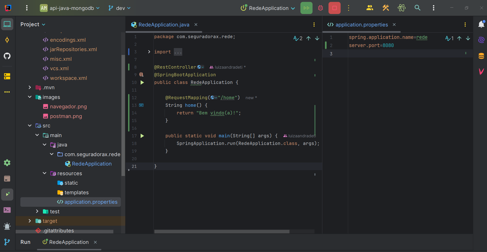
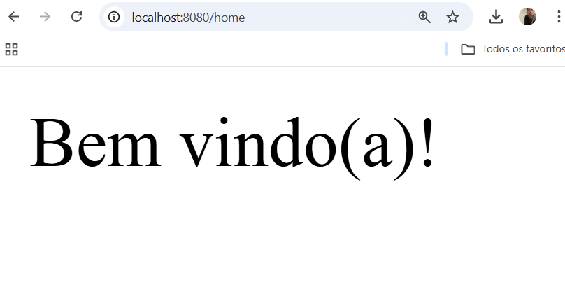
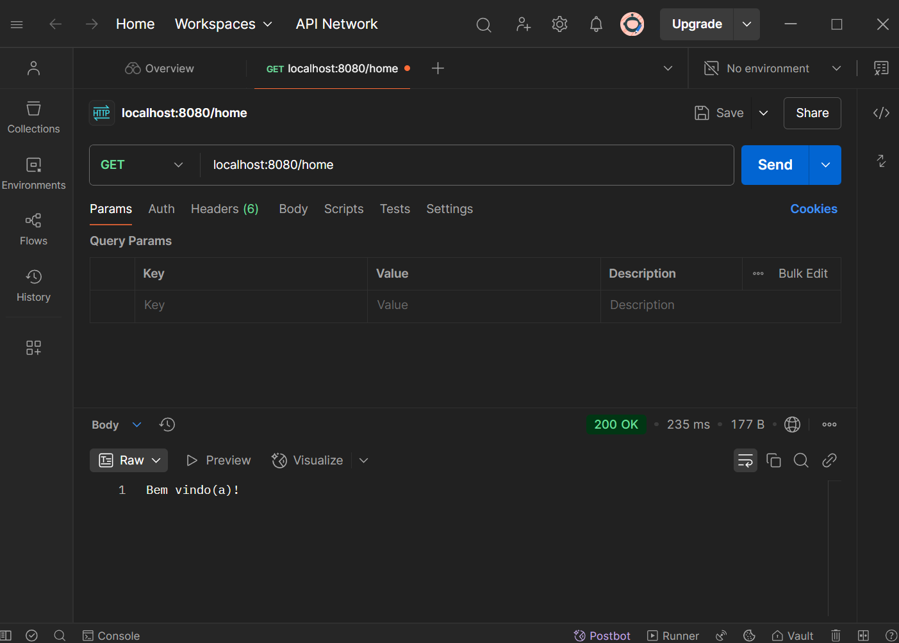
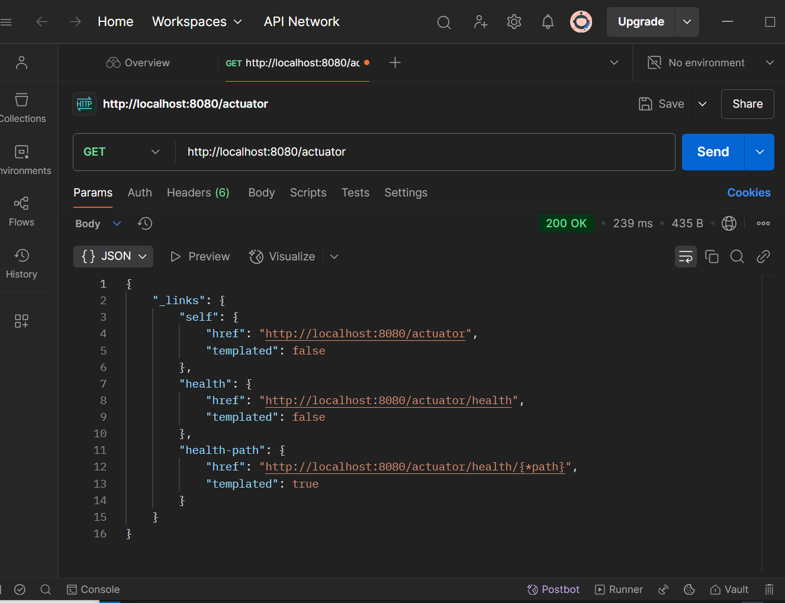
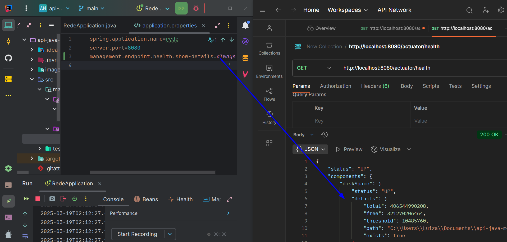
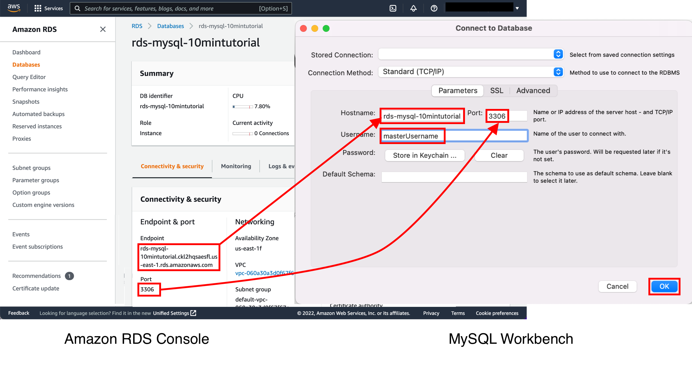
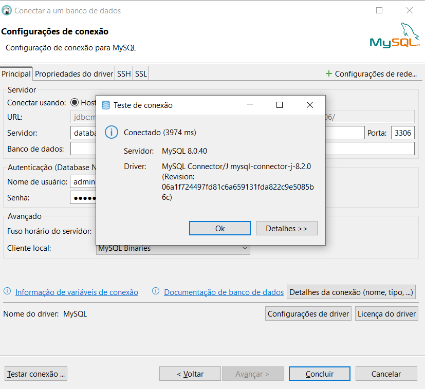
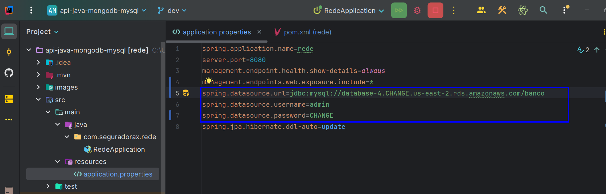
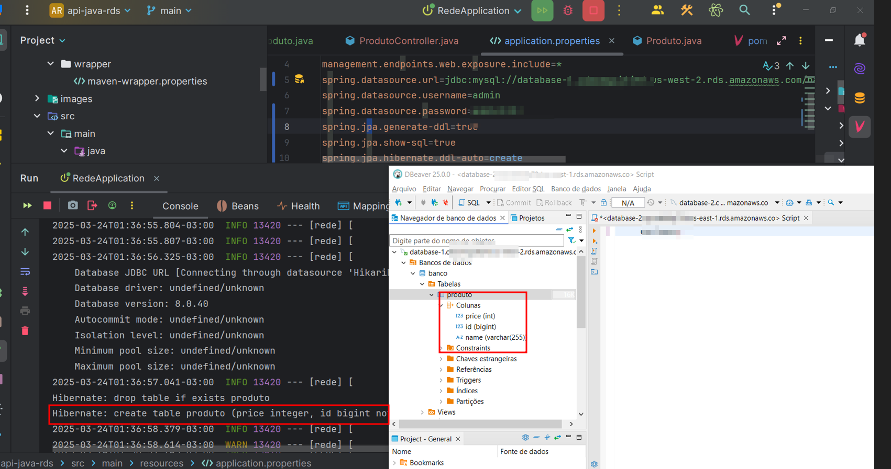

  <h2 align="center"> Spring API MongoDB e MySQL</h2> 
<center>

[](https://skillicons.dev)


[](/#/)


</center>

## 🔗 Links

[](https://br.linkedin.com/in/luiza-andrade-ti/) [](https://github.com/luizaandradeti/)


## Tech Stack 🔨
**Client:** Postman
**Backend softwares:** Java 17, IntelliJ


## Get Started 🚀 

### 1. Create Spring Project  ⚡️
- https://start.spring.io/ 
    - Spring Web 
    - Spring Boot DevTools Developer Tools

### 2. View 🌐

 **First endpoint, go to localhost:8080/home**

 


 

  

### 3. Actuator in the scene 🔬

 *Include the actuator dependency in pom.xml*

[](https://mvnrepository.com/artifact/org.springframework.boot/spring-boot-starter-actuator/1.2.1.RELEASE)
````
<dependency>
	<groupId>org.springframework.boot</groupId>
	<artifactId>spring-boot-starter-actuator</artifactId>
</dependency>
````
For more information, please visit the Maven website:
	- https://mvnrepository.com/

- Now, go to localhost:8080/actuator





### 4. Connection with RDS Database 😄   

*Include the JPA and MySQL lib in the pom xml, to connect the api to the AWS database and perform queries and data persistence through ORM*

[]([https://mvnrepository.com/search?q=MYSQL)

[](https://mvnrepository.com/artifact/jakarta.persistence/jakarta.persistence-api/3.2.0)

[](https://mvnrepository.com/artifact/org.springframework.boot/spring-boot-starter-test/3.4.4)


````
	<dependency>
		<groupId>mysql</groupId>
		<artifactId>mysql-connector-java</artifactId>
		<version>8.0.33</version>
	</dependency>

	<dependency>
		<groupId>jakarta.persistence</groupId>
		<artifactId>jakarta.persistence-api</artifactId>
	</dependency>

	<dependency>
   		<groupId>org.springframework.boot</groupId>
    	<artifactId>spring-boot-starter-data-jpa</artifactId>
    </dependency>

````

*Please first test the connection to the database in DBeaver, with the dev password provided to you by the cloud administrator*

<center><font size="1">https://aws.amazon.com/pt/getting-started/hands-on/create-mysql-db/</font></center>



*Now, Set AWS RDS credentials in the application.properties file, 



*create the table and jpa classes (product class and repository interface) and execute*




### 5.  Micrometer with AWS Cloud Watch -></a></td>
	


[](/#/)
